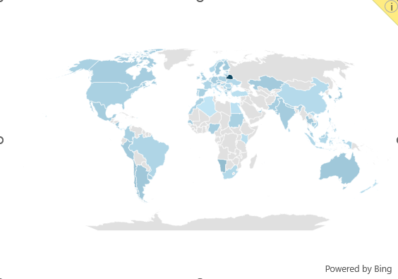

# Excel Salary Dashboard

<a href="1_Salary_Dashboard.xlsx" target="_blank">
  
</a>

## Introduction

This data jobs salary dashboard was built to help job seekers investigate salaries for their desired roles and ensure they are being adequately compensated. Using a real-world dataset of 2023 job postings (job titles, salaries, locations, and skills), this project turns raw data into a single, interactive Excel interface for exploring compensation trends.

### Dashboard File
You can find the file for the dashboard here: [`1_Salary_Dashboard.xlsx`](1_Salary_Dashboard.xlsx).

## Skills Showcased

This project was a deep dive into core Excel analytics features. Here's what was covered:

- **⚙️ Data Cleaning & Prep:** Cleaned and standardized ~32,000 job records — handling nulls, duplicates, and inconsistent job titles before analysis.
- **🧮 Array Formulas & Functions:** Built dynamic formulas using `MEDIAN`, `IF`, `FILTER`, and `SEARCH` for multi-criteria salary calculations.
- **📉 Charts:** Used horizontal bar charts and map charts to visualize salary comparisons and geographic trends.
- **❎ Data Validation:** Implemented dropdown-based data validation to restrict user input and prevent inconsistent entries.
- **🎨 Dashboard Design:** Designed a clean, single-page layout combining KPIs, charts, and filters for quick decision-making.

---

## Dashboard Build

### 📊 Data Science Job Salaries — Bar Chart


- **Excel Features:** Horizontal bar chart with formatted salary values, optimized layout for clarity.
- **Data Organization:** Job titles sorted by descending median salary for improved readability.
- **Insight:** Senior roles and Engineers command higher pay than Analyst-level roles.

### 🗺️ Country Median Salaries — Map Chart



- **Excel Features:** Map chart plotting median salary by country.
- **Design Choice:** Color-coded regions to visually differentiate salary levels.
- **Insight:** Quickly surfaces global salary disparities and highlights high/low-paying regions.

### 🧮 Median Salary by Job Title (Array Formula)

```excel
=MEDIAN(
  IF(
    (jobs[job_title_short]=A2)*
    (jobs[job_country]=country)*
    (ISNUMBER(SEARCH(type,jobs[job_schedule_type])))*
    (jobs[salary_year_avg]<>0),
    jobs[salary_year_avg]
  )
)
```


- **Multi-Criteria Filtering:** Checks job title, country, and schedule type, while excluding blank salaries.
- **Array Formula:** Combines `MEDIAN()` with a nested `IF()` to evaluate the full array at once.
- **Purpose:** Powers the dashboard's dynamic salary lookup by title, region, and job type.

### ⏰ Count of Job Schedule Type

```excel
=FILTER(J2#,(NOT(ISNUMBER(SEARCH("and",J2#))+ISNUMBER(SEARCH(",",J2#))))*(J2#<>0))
```


- **Unique List Generation:** Uses `FILTER()` to exclude entries containing "and" or commas, and to drop zero values.
- **Purpose:** Generates a clean list of unique job schedule types used elsewhere in the dashboard.

### ❎ Data Validation


- Applied filtered lists as validation rules on the **Job Title**, **Country**, and **Type** inputs.
- Restricts user input to predefined, validated options.
- Prevents incorrect or inconsistent entries and improves overall dashboard usability.

---

## Dashboard Overview


The final dashboard brings everything together in a single view: job title, country, and type selectors driving a live bar chart, map chart, and schedule-type breakdown, plus at-a-glance KPI cards for **Median Salary**, **Top Job Platform**, and **Job Count**.

## Conclusion

This dashboard showcases how Excel — with array formulas, charts, and data validation — can turn raw job posting data into a practical tool for career analysis. It allows users to filter by job title, country, and schedule type to make informed decisions about their career paths.
